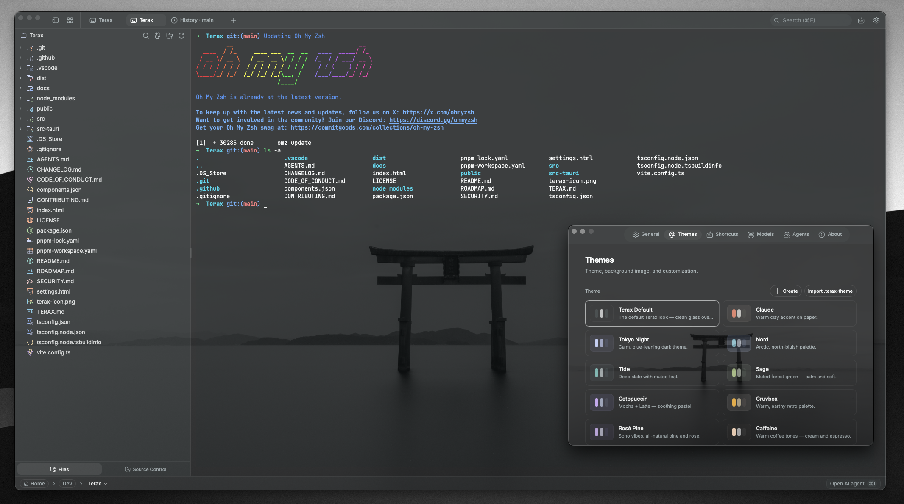

<div align="center">
  
  <h1>Kite</h1>

  <p><strong>轻量级终端优先的 AI 原生开发工作空间</strong></p>

  <p>
    
    
    
    <a href="https://discord.gg/tyveTUyEp7"></a>
  </p>

  <p>
    <a href="https://github.com/kelongyan/Kite">源代码</a>
    ·
    <a href="https://github.com/kelongyan/Kite/releases">下载</a>
  </p>
</div>

---

Kite 是一个基于 Tauri 2 + Rust 和 React 19 构建的轻量级开源终端（AI 驱动开发环境）。采用原生 PTY 后端与 WebGL 渲染器，内置智能 AI 侧边栏（支持自带密钥或完全本地模型）、代码编辑器、文件资源管理器、带提交图的源码管理、以及网页预览面板。体积仅约 7-8 MB，无遥测，无需注册。

## 截图

<table>
  <tr>
    <td align="center"><br/><sub>WebGL 渲染的多标签终端</sub></td>
    <td align="center"><br/><sub>自定义主题、预设和背景图片</sub></td>
  </tr>
  <tr>
    <td align="center"><br/><sub>本地开发服务器的网页预览</sub></td>
    <td align="center"><br/><sub>源码管理面板与历史提交图</sub></td>
  </tr>
  <tr>
    <td colspan="2" align="center"><br/><sub>智能 AI 工作流与代码编辑器中的差异对比</sub></td>
  </tr>
</table>

## 功能特性

### 终端

- 基于 xterm.js 的 WebGL 渲染器，多标签页后台流式输出
- GPU 加速的块状终端，编辑器级命令输入体验
- 原生 PTY 后端（基于 `portable-pty`），支持 zsh、bash、pwsh、fish、cmd
- 分屏面板（水平和垂直分割）
- 内联搜索、链接检测、真彩色支持
- Windows 下的工作区环境切换（本地或任意已安装的 WSL 发行版）

### 代码编辑器

- CodeMirror 6（支持所有流行语言：TS/JS、Rust、Python、Go、C/C++、Java、HTML/CSS、JSON、Markdown 等）
- 内联 AI 自动补全（支持本地模型）
- AI 编辑差异对比，逐块接受或拒绝
- Vim 模式
- 十种内置编辑器主题：Atom One、Aura、Copilot、GitHub Dark/Light、Gruvbox Dark、Nord、Tokyo Night、Xcode Dark/Light

### 源码管理

- Stage/Unstage 代码块，提交（Cmd+Enter / Ctrl+Enter），智能推送
- 分支显示（包括 detached HEAD 状态）
- Git 历史面板，真实的提交图（支持合并和分支的泳道渲染）
- 提交搜索和过滤，点击跳转到远程提交页面

### 文件资源管理器

- Catppuccin 图标主题
- 模糊搜索、键盘导航、内联重命名、上下文操作
- 直接附加文件和选中内容到 AI 侧边栏

### 网页预览

- 自动检测本地开发服务器并在预览标签页中打开
- 通过原生子 webview 预览外部 URL

### 主题与自定义

- 应用内创建自定义主题，在内置预设和自定义主题之间切换
- 创建自己的主题，分享或从社区导入
- 背景图片（可调节透明度和模糊度）
- 编辑器主题独立于应用主题

### AI 功能

- **自带密钥的云提供商：** OpenAI、Anthropic、Google（Gemini）、Groq、xAI（Grok）、Cerebras、OpenRouter、DeepSeek、Mistral，以及任何兼容 OpenAI 的端点
- **本地/离线：** LM Studio、MLX、Ollama
- **智能工作流：** 规划、子代理、通过 `TERAX.md` 的项目记忆、文件读/写/编辑/多文件编辑/grep/glob、带审批机制的 bash、后台进程
- **编辑器：** 通过 `#handle` 使用代码片段、通过 `@path` 引用文件、斜杠命令、语音输入、从资源管理器或选中内容附加到代理
- **自定义代理**，拥有独立的系统提示和工具子集
- **规划模式**，用于多步骤工作，先生成计划并确认再执行

## 安装

最新安装包可在 [Releases](https://github.com/kelongyan/Kite/releases/latest) 页面下载。此分支已禁用自动更新检查。

### Windows 注意事项

- 首次启动时 Windows 会显示"Windows 已保护你的电脑"，因为 Kite 尚未进行代码签名。点击**更多信息**然后**仍要运行**。
- 默认 Shell 检测优先级：`pwsh.exe`（PowerShell 7+）-> `powershell.exe`（Windows PowerShell 5.1）-> `cmd.exe`。
- WSL 是一等公民的工作区环境，而非封装的子进程。

### Linux 注意事项

- **NixOS / Nix**：使用本仓库的 flake — `nix profile install github:kelongyan/Kite`（非 NixOS），或导入 flake 并将 `inputs.kite.packages.${pkgs.system}.kite` 添加到 `environment.systemPackages`（NixOS）。
- **AppImage**：需要 FUSE。如果没有：`./Kite_*.AppImage --appimage-extract-and-run`。在 Wayland 下如遇渲染问题，尝试 `WEBKIT_DISABLE_DMABUF_RENDERER=1`。否则 `.deb` / `.rpm` 包链接系统 GTK 栈，通常更流畅。

## 配置 AI

1. 打开**设置 -> AI**。
2. 选择提供商并粘贴你的 API 密钥。对于本地推理，将 Kite 指向你的 LM Studio / MLX / Ollama 端点。
3. 密钥通过 `keyring` 写入操作系统密钥链，永不触及磁盘或 localStorage。

## 从源码构建

**前置要求**
- Rust（stable），https://rustup.rs
- Node 20+ 和 [pnpm](https://pnpm.io)
- Tauri 平台前置依赖，https://tauri.app/start/prerequisites/

**运行**
```bash
pnpm install
pnpm tauri dev          # 开发模式
pnpm tauri build        # 生产构建
```

**代码检查**
```bash
pnpm exec tsc --noEmit                                            # 前端类型检查
cd src-tauri && cargo clippy --all-targets --locked -D warnings   # Rust lint（与 CI 一致）
cd src-tauri && cargo test --locked                               # Rust 测试
```

## 技术栈

Tauri 2、Rust、`portable-pty`、React 19、TypeScript、Vite、xterm.js、CodeMirror 6、Vercel AI SDK v6、Tailwind v4、shadcn/ui、Zustand。

## 贡献

欢迎提交 Issue 和 PR！可以自由地开 Issue、建议功能或提交 Pull Request。更多详情参见 [CONTRIBUTING.md](CONTRIBUTING.md)。

## 许可证

Kite 采用 Apache-2.0 许可证。本项目基于 Crynta 的上游 Terax 项目开发。有关依赖的更多信息，请参见 [Apache License 2.0](LICENSE)。

## Star 历史

<div align="center">
  <a href="https://www.star-history.com/#kelongyan/Kite&Date">
    <picture>
      <source media="(prefers-color-scheme: dark)" srcset="https://api.star-history.com/svg?repos=kelongyan/Kite&type=Date&theme=dark" />
      <source media="(prefers-color-scheme: light)" srcset="https://api.star-history.com/svg?repos=kelongyan/Kite&type=Date" />
      
    </picture>
  </a>
</div>
