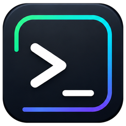
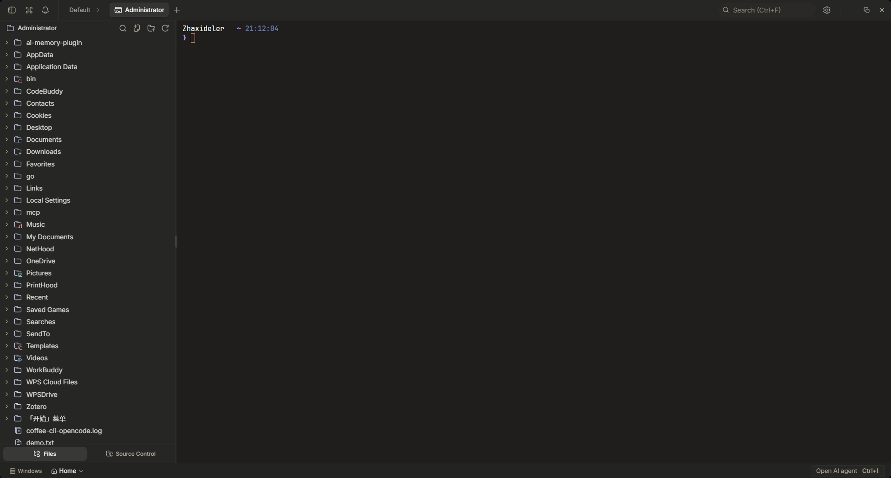
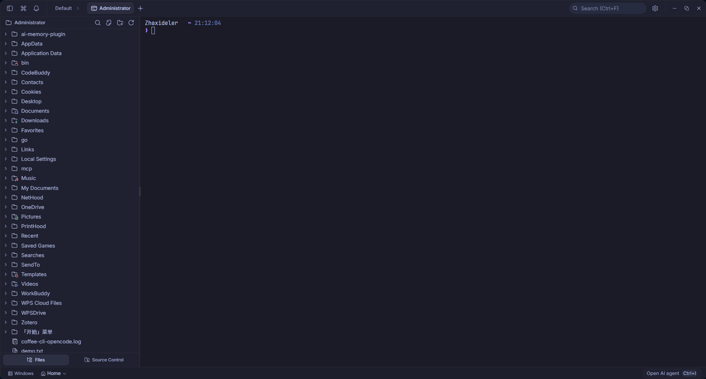
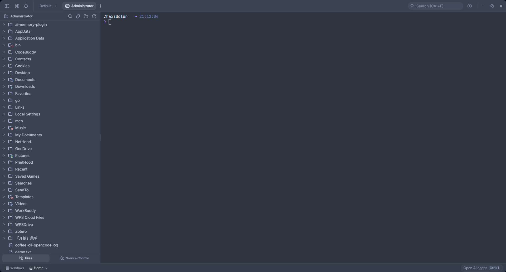
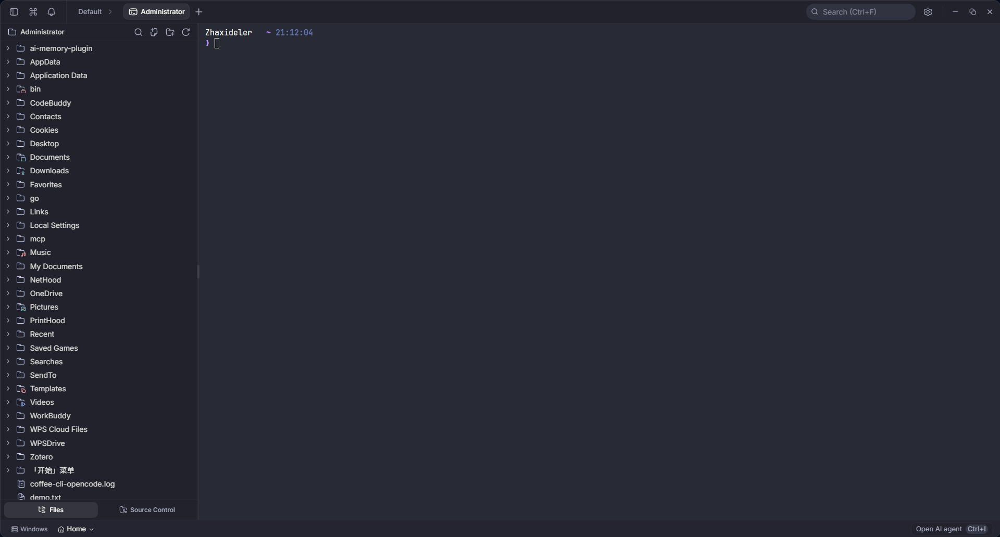

<div align="center">
  

  <h1>Kite</h1>

  <p><strong>终端优先的 AI 原生开发工作空间</strong></p>
  <p>一个轻量、开源、面向开发者日常工作的桌面终端与 AI Agent 工具。</p>

  <p>
    <a href="https://github.com/kelongyan/Kite/releases/latest">
      
    </a>
    <a href="LICENSE">
      
    </a>
    
    
  </p>

  <p>
    <a href="https://github.com/kelongyan/Kite/releases/latest">下载安装包</a>
    ·
    <a href="https://github.com/kelongyan/Kite">查看源码</a>
    ·
    <a href="https://github.com/kelongyan/Kite/issues">反馈问题</a>
  </p>
</div>

---

Kite 是一个基于 Tauri 2、Rust、React 和 TypeScript 构建的开源桌面应用。它把原生终端、文件浏览、代码编辑、源码管理、网页预览、语音输入和 AI Agent 放进同一个轻量工作台里，让你在一个窗口中完成“看项目、跑命令、改代码、问 AI、验结果”的开发流程。

项目当前的定位不是传统 IDE，也不是单纯聊天窗口，而是一个终端优先的 AI-native terminal emulator。你可以继续使用熟悉的 shell、Git 和本地工具，同时让 Kite 读取当前上下文、协助执行任务，并在关键操作前保留审批边界。

## 界面预览

<table>
  <tr>
    <td align="center">
      
      <br />
      <sub>默认主题：终端、文件侧栏和多标签工作区</sub>
    </td>
    <td align="center">
      
      <br />
      <sub>蓝色主题：更冷静的深色工作台</sub>
    </td>
  </tr>
  <tr>
    <td align="center">
      
      <br />
      <sub>Slate 主题：低对比、长时间写代码更舒服</sub>
    </td>
    <td align="center">
      
      <br />
      <sub>Midnight 主题：聚焦终端输入与文件浏览</sub>
    </td>
  </tr>
</table>

## 核心能力

- **原生终端体验**：基于 `portable-pty` 与 xterm.js，支持多标签、分屏、WebGL 渲染、搜索、链接识别、真彩色和后台输出。
- **终端优先工作流**：保留 shell、Git、包管理器和本地 CLI 的使用方式，同时让 AI 读取当前目录、近期命令与输出。
- **AI Agent 助手**：支持规划、工具调用、文件读写、多文件编辑、grep/glob、后台进程和需要审批的命令执行。
- **模型自由选择**：支持 OpenAI、Anthropic、Google Gemini、Groq、xAI、Cerebras、OpenRouter、DeepSeek、Mistral，以及任意 OpenAI-compatible 端点。
- **本地模型支持**：可连接 LM Studio、Ollama、MLX 等本地推理服务，适合离线或私有环境使用。
- **代码编辑与 Diff**：内置 CodeMirror 6，支持常见语言高亮、Vim 模式、编辑器主题、AI 编辑结果对比与逐块接受。
- **文件与源码管理**：提供文件树、快速搜索、重命名、上下文操作、Git 变更查看、暂存、提交和历史图。
- **网页预览**：可打开本地开发服务或外部 URL，用于快速查看前端项目、文档站和调试页面。
- **语音输入与通知**：支持语音转写，并可在 Codex、Claude Code、Gemini 等终端 Agent 需要关注或完成任务时提醒。
- **主题与字体**：使用更适合开发环境的字体与暗色主题体系，可按偏好切换工作台视觉风格。

## 适合谁

- 日常大量使用终端、Git 和 CLI 工具的开发者。
- 想把 AI 编码助手放进真实项目上下文，而不是只在网页聊天框里复制粘贴的人。
- 需要同时处理终端、文件、编辑器、源码管理和本地预览的小型桌面工作台用户。
- 希望自行配置云模型或本地模型，并保留数据与密钥控制权的用户。

## 安装

最新版本请前往 [Releases](https://github.com/kelongyan/Kite/releases/latest) 下载。

Windows 用户如果首次启动时看到 SmartScreen 提示，这是因为当前安装包未进行商业代码签名。可以点击“更多信息”，再选择“仍要运行”。

Linux 用户可以选择 AppImage、deb、rpm 或 Nix 相关方式。使用 AppImage 时如果系统缺少 FUSE，可尝试：

```sh
./Kite_*.AppImage --appimage-extract-and-run
```

## 配置 AI

1. 打开 `Settings` 中的模型配置页面。
2. 选择你要使用的提供商，填入模型名称、API Key 或本地服务地址。
3. 如果使用 LM Studio、Ollama、MLX 或其他 OpenAI-compatible 服务，请确认本地服务已经启动。
4. 需要项目级记忆时，可以使用内置命令生成或维护 `TERAX.md`，Kite 会把它作为项目上下文的一部分。

API Key 会通过系统密钥链保存，避免直接写入项目文件或前端本地存储。

## 从源码运行

**环境要求**

- Node.js 22 或更高版本
- pnpm 11.x
- Rust stable
- Tauri 2 平台依赖，参考 [Tauri prerequisites](https://tauri.app/start/prerequisites/)

**开发模式**

```sh
pnpm install
pnpm tauri dev
```

**生产构建**

```sh
pnpm tauri build
```

**常用检查**

```sh
pnpm check-types
pnpm test
pnpm lint

cd src-tauri
cargo test --locked
cargo clippy --all-targets --locked -- -D warnings
```

## 技术栈

- **桌面框架**：Tauri 2
- **后端核心**：Rust、`portable-pty`
- **前端框架**：React 19、TypeScript、Vite
- **终端渲染**：xterm.js、WebGL addon
- **编辑器**：CodeMirror 6
- **AI 能力**：Vercel AI SDK v6、多提供商适配、本地模型端点
- **界面与状态**：Tailwind CSS v4、shadcn/ui、Zustand
- **质量工具**：Biome、Vitest、Cargo test、Cargo clippy

## 贡献

欢迎提交 Issue、功能建议和 Pull Request。改动前建议先查看现有代码风格，并尽量保持修改范围清晰、可验证。

如果你要提交较大的功能，请先开 Issue 说明动机、预期行为和可能影响；如果只是修复小问题，可以直接提交 PR。

## 许可证

Kite 使用 [Apache License 2.0](LICENSE) 开源许可。

## 致谢

Kite 最初 fork 自 Crynta 的 Terax AI 项目：[crynta/terax-ai](https://github.com/crynta/terax-ai)。感谢原作者和社区为这个开源基础所做的工作，也感谢所有后续参与改进、反馈和测试的朋友。
